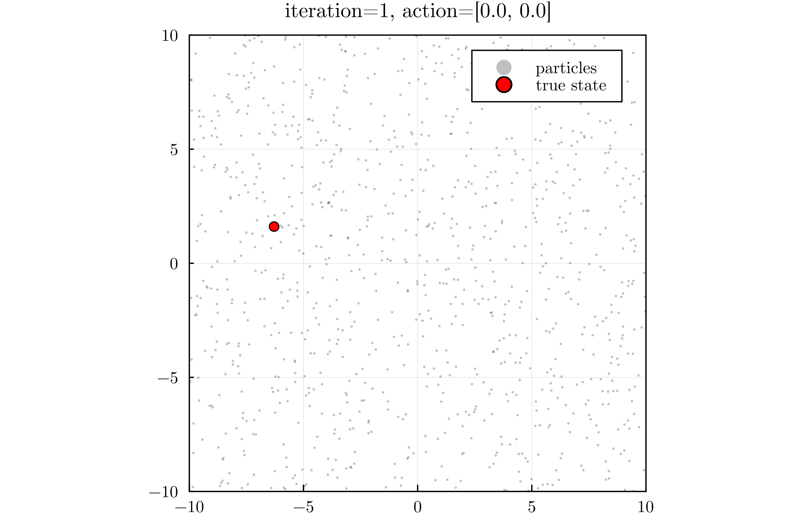

# StateEstimation.jl
<!-- [](https://github.com/mossr/StateEstimation.jl) -->

Section for CS238/AA228 *Decision Making Under Uncertainty* at Stanford University.

Belief state estimation in [Pluto](https://github.com/fonsp/Pluto.jl) notebooks.

```julia
] dev https://github.com/mossr/StateEstimation.jl
```
Then open Julia, run `using Pluto; Pluto.run()`, and open notebooks in `~/.julia/dev/StateEstimation/src/`.


# Pluto notebooks

<!-- [](http://htmlview.glitch.me/?https://raw.githubusercontent.com/mossr/StateEstimation.jl/master/html/section_overview.html)
 -->

## Crying baby POMDP

[](http://htmlview.glitch.me/?https://raw.githubusercontent.com/mossr/StateEstimation.jl/master/html/crying_baby_problem.html)

<p align="center">
  <kbd>
    <a href="http://htmlview.glitch.me/?https://raw.githubusercontent.com/mossr/StateEstimation.jl/master/html/crying_baby_problem.html">
      
    </a>
  </kbd>
</p>

- [POMDPs.jl version located here](https://htmlview.glitch.me/?https://github.com/JuliaAcademy/Decision-Making-Under-Uncertainty/blob/master/html/2-POMDPs.jl.html)


## Kalman filtering

[](http://htmlview.glitch.me/?https://raw.githubusercontent.com/mossr/StateEstimation.jl/master/html/kalman_filter.html)
<p align="center">
  <a href="http://htmlview.glitch.me/?https://raw.githubusercontent.com/mossr/StateEstimation.jl/master/html/kalman_filter.html">
    
  </a>
</p>


## Particle filtering

[](http://htmlview.glitch.me/?https://raw.githubusercontent.com/mossr/StateEstimation.jl/master/html/particle_filter.html)
<p align="center">
  <a href="http://htmlview.glitch.me/?https://raw.githubusercontent.com/mossr/StateEstimation.jl/master/html/particle_filter.html">
    
  </a>
</p>

<!-- 
## Exact belief state planning

[](https://github.com/mossr/StateEstimation.jl)
 -->

## Slides

Slides generated using [julia-tufte-beamer](https://github.com/mossr/julia-tufte-beamer) and located here: [**Beliefs: State Uncertainty**](https://github.com/mossr/julia-tufte-beamer/blob/aa228/beliefs/main.pdf)

<p align="center">
<kbd>
  <a href="https://github.com/mossr/julia-tufte-beamer/blob/aa228/beliefs/main.pdf">
    
  </a>
</kbd>
</p>

---
Written by [Robert Moss](https://github.com/mossr).
